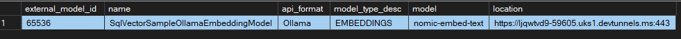

Document indexing and semantic search with an Azure Function App and SQL Server 2025


Create an empty Aspire application. I used my own template to set this up with some default files.

Because this uses ManagePackageVersionsCentrally, you might need to update the references in projects that you add - make sure they are in `Directory.Packages.props` and remove the version from the `.csproj' files.

Add a reference to the ServiceDefaults project and call builder.AddServiceDefaults() in Program.cs.

Remove app insights because it will be managed via service defaults:
```csharp
builder.Services
    .AddApplicationInsightsTelemetryWorkerService()
    .ConfigureFunctionsApplicationInsights();
```

When adding projects you can remove these lines from the `'csproj` files because they are in Directory.build.props:
```csharp
    <TargetFramework>net10.0</TargetFramework>
    <ImplicitUsings>enable</ImplicitUsings>
    <Nullable>enable</Nullable>
```

## Outline

- Introductory paragraph(s) about SQL Server 2005 now having vectors. 
- Goals 
  - use Azure functions to process document from arXiv into a SQL Server database and generate embeddings for the summary
  - a second function will search
  - NOT a full RAG solution at this pint. We just want to show how to add embeddings for semantic search.
- Architecture
  - describe basic architecture  
  - Aspire for hosting and running locally - "local-first" cloud native...
  - Ollama for simplicity and local development  
  - Embedding model - `nomic-embed-text` [Nomic](https://www.nomic.ai/news/nomic-embed-text-v1), see details on [Hugging Face](https://huggingface.co/nomic-ai/nomic-embed-text-v1.5)
      - nomic-embed-text is a large context length text encoder that surpasses OpenAI text-embedding-ada-002 and text-embedding-3-small performance on short and long context tasks.
      - dimensionality can be changed but we will use 768.
  - We don't need a chat model at this stage since we are only searching, but it might be added later.
  - SQL Server in Docker
  - DBUp for deployment
- Aspire AppHost - describe and show code
- SQL Server 2025 Schema and Embedding model setup
- Azure Function: Insert Pipeline 
  - http-triggered function that takes a list of arXiv document ids and queries the details
  - insert and create embedding
  - simple approach; in production it might be better to send a message to another function via a queue or ServiceBus and do the embedding there
    - also mention article on SQL trigger that will do the embedding for us
  - search query - takes a string and returns search reasults. Can test using curl or Postman for simplicity, so no need for an extra web or console app


## Aspire AppHost

We'll need a few nuget packages for Azure functions, SQL Server, Ollama, and DevTunnels - we'll need this last one so that SQL Server can talk to Ollama over https.
```
Aspire.Hosting.Azure.Functions
Aspire.Hosting.DevTunnels
Aspire.Hosting.SqlServer
CommunityToolkit.Aspire.Hosting.Ollama
```

I've created a shared project which has constants that can be used in place of the magic strings that Aspire templates have given us, and set shortened project names to siumplify the AppHost code. Note the additional Aspire attributs in my project file:
```
<ProjectReference Include="..\Sql.SemanticSearch.Ingestion.Functions\Sql.SemanticSearch.Ingestion.Functions.csproj" AspireProjectMetadataTypeName="SemanticFunctions" />
<ProjectReference Include="..\Sql.SemanticSearch.Shared\Sql.SemanticSearch.Shared.csproj" IsAspireProjectResource="false" />
```

Set up
  - Ollama with optional GPU support - this is controlled with a parameter which needs to be added to your secrets. It defaults to false
  - SQL Server. This has a persistent lifetime and a data volume so it we don't need to set it up every time. Note the image has to be set because the default in Aspire is sql-2022 - this will no doubt be fixed in a future release. There are parameters for a default port and password; if provided this makes it easier to query the database from Sql Management Studio because the connection string won't change.
  
Parameters:
```
"Parameters": {
  "EmbeddingModel": "nomic-embed-text",
  "EmbeddingDimensions": 768,
  "SqlServerPort": "",
  "SqlServerPassword": "",
  "OllamaGpuVendor": ""
},
```

## Database deployment

DbUp
Note for future changes: https://elanderson.net/2020/08/always-run-migrations-with-dbup/

You can check that the model wqas deployed by running
```
SELECT [external_model_id], [name], [api_format], model_type_desc, [model], [location]
FROM sys.external_models
```



I've included a script that drops all the tables in the repo - sql/clean_documents_database.sql.

## Future improvements

- add an MCP server as a function and show how it can be used from a client like GitHub Copilot
- add a notebook showing the difference between PdfPig in C# and Docling in Python for extracting chunking PDF files
- implement the chunking in another function
- deploy to Azure

---
[!NOTE] 
> Source code is available on [GitHub](https://github.com/mikewild-wcl/semanticsearch)


## References

    https://devblogs.microsoft.com/azure-sql/efficiently-and-elegantly-modeling-embeddings-in-azure-sql-and-sql-server/
