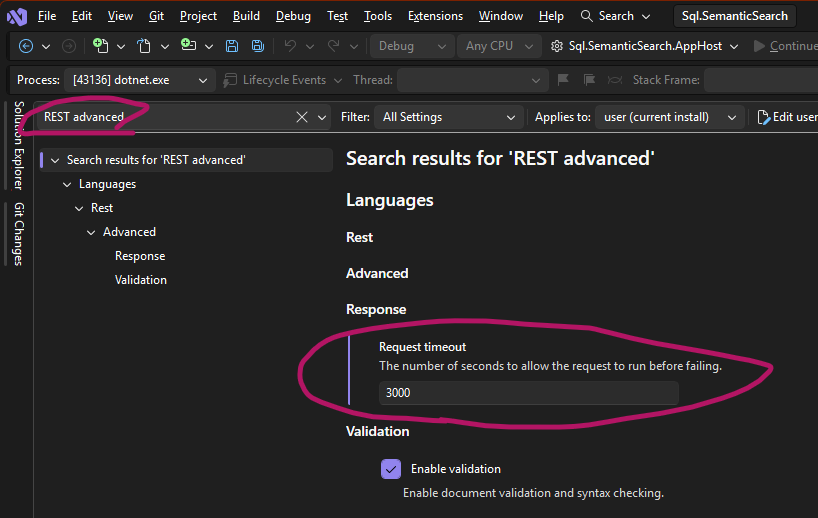

# Document indexing and semantic search with an Azure Function App and SQL Server 2025

In November 2025 Microsoft release SQL Server 2025, which, like everything else from Microsoft recently, is heavily AI-focussed. It introduces a native vector data type and the ability to call external large language models. This opens up new ways of searching information in SQL Server, as well as in Azure SQL which already had the new types.

Vector search is important for building intelligent applications, allowing semantic search, RAG pipelines, product matching, data classification, and more. 

Specialized vector databases are available, but for SQL Server users that meant a more complicated architecture,  generating vector embeddings in code and saving them into inefficient structures. Now everything is much simpler.

**Azure Functions** are a simple, cloud-native way to add semantic intelligence to any application.

???????????????????
This article looks at how to use Azure functions to 
 - process document from arXiv into a SQL Server database 
 - generate vector embeddings for the summary
 - allow search

We'll use Aspire for hosting and running locally - what I think of as "local first - cloud native". It lets us run a database, functions, and an embedding model locally without needing to set up resources on Azure or running scripts. The embedding model will be run in Ollama, again because it can run locally. I'm not going into detail on how that works; that can come another day.

This is intended as an initial proof of concept, so it isn't a full RAG solution. We just want to show how to add embeddings for semantic search; a future iteration could download files, chunk them into the database, and add a chat capability.


## Embedding model

For this project I've chosen `nomic-embed-text` as the embedding model. If you want to dig into the details see [Nomic](https://www.nomic.ai/news/nomic-embed-text-v1), or go to [Hugging Face](https://huggingface.co/nomic-ai/nomic-embed-text-v1.5).
It's a large context length text encoder that performs better than OpenAI `text-embedding-ada-002` and `text-embedding-3-small`, but if I migrate to OpenAI in a production environment I'd probably go for `text-embedding-3-small`. The model isn't important but what IS important is using the same model for all embedding tasks,

The model has 768 dimensions by default and we'll need to remember that when creating our SQL tables.

e don't need a chat model at this stage since we are only searching, but it might be added later.


## SQL Server 2025 Schema and Embedding model setup

The SQL Server tables are fairly simple.

First make sure server allows external REST endpoints: 

``` sql
EXEC sp_configure 'external rest endpoint enabled', 1;
RECONFIGURE WITH OVERRIDE;
```

We have a table for documents which includes summary text and metadata as a JSON column containing authors and tags, plus an index for it.
**Link to Davide M article**

``` sql
CREATE TABLE dbo.Documents
(
    [Id] INT IDENTITY CONSTRAINT PK_Documents primary key,
    [ArxivId] NVARCHAR(50) NULL,
    [Title] nvarchar(300) NOT NULL,
    [Summary] nvarchar(max) NULL,
    [Comments] nvarchar(max) NULL,
    [Metadata] JSON NULL,
    [PdfUri] NVARCHAR(1000) NOT NULL,
    [Published] DATETIME2(0) NOT NULL,
    [Created] DATETIME2(7) NOT NULL CONSTRAINT DF_Documents_Created DEFAULT (SYSUTCDATETIME()),
    [Updated] DATETIME2(7) NULL,
    [LastUpdatedOn] datetime2(0) NULL
)
GO
CREATE JSON INDEX IX_Documents_Metadata ON dbo.Documents(Metadata) FOR ('$');
GO
```

Summary and Metadata are going to be turned into vector embeddings so we have a table for each of those - Microsoft recommends doing it this way. Note the `$EMBEDDING_DIMENSIONS$` which has the number of dimensions (768).

``` sql
EXEC('CREATE TABLE dbo.DocumentSummaryEmbeddings (
    [Id] INT NOT NULL,
    [Embedding] VECTOR($EMBEDDING_DIMENSIONS$) NOT NULL,
    [Created] DATETIME2(7) NOT NULL CONSTRAINT DF_DocumentSummaryEmbeddings_Created DEFAULT (SYSUTCDATETIME()),
    CONSTRAINT FK_DocumentSummaryEmbeddings_Documents FOREIGN KEY (Id) REFERENCES Documents(Id))')
```

``` sql
EXEC('CREATE TABLE dbo.DocumentMetadataEmbeddings (
    [Id] INT NOT NULL,
    [Embedding] VECTOR($EMBEDDING_DIMENSIONS$) NOT NULL,
    [Created] DATETIME2(7) NOT NULL CONSTRAINT DF_DocumentMetadataEmbeddings_Created DEFAULT (SYSUTCDATETIME()),
    CONSTRAINT FK_DocumentMetadataEmbeddings_Documents FOREIGN KEY (Id) REFERENCES Documents(Id))')
```

Finally we need to set up the Ollama embedding model. If we were using OpenAI then there some security settings need to configured, but those aren't needed for Ollama.

One problem with using Ollama is that it only exposes an http endpoint. If you look at other articles r books they'll tell you to set up an https proxy of one sort or another, but because we're using Aspire a dev tunnel can do the job. The uri for that needs to be passed into the setup script below. I drop and recreate it each time because I've been bitten by Aspire changing the dev tunnel uri and port.
``` sql
IF EXISTS (SELECT * FROM sys.external_models WHERE name = '$EXTERNAL_EMBEDDING_MODEL$')
BEGIN
    EXEC('DROP EXTERNAL MODEL $EXTERNAL_EMBEDDING_MODEL$')
END

EXEC('CREATE EXTERNAL MODEL $EXTERNAL_EMBEDDING_MODEL$
      WITH (
        LOCATION = ''$AI_CLIENT_ENDPOINT$'',
        API_FORMAT = ''OLLAMA'',
        MODEL_TYPE = EMBEDDINGS,
        MODEL = ''$EMBEDDING_MODEL$'')')
```

You can check that the model was deployed by running this in SSMS:
```
SELECT [external_model_id], [name], [api_format], model_type_desc, [model], [location]
FROM sys.external_models
```


## Azure Function: Insert Pipeline 

I decided to use a function for ingestion. It has s simple HTTP trigger that takes a list of document ids; in a production-level application this could be part of a pipeline that looks for new documents and queues them for processing.

For data I'm using arXiv, because this has an open and easy-to-use API that returns a few interesting properties.

  - http-triggered function that takes a list of arXiv document ids and queries the details
  - insert and create embedding
  - simple approach; in production it might be better to send a message to another function via a queue or Service Bus and do the embedding there

  - also mention article on SQL trigger that will do the embedding for us

  *arxiv API client*
``` csharp

```

Once we have the paper it gets saved by a series of calls to the database, all wrapped in a transaction.

``` csharp
using var connection = _databaseConnection.CreateConnection();
connection.Open();
using var transaction = connection.BeginTransaction();

await DeleteExistingDocumentIfExists(paper.Id, transaction);

var documentId = await SaveDocument(paper, transaction);
await SaveDocumentSummaryEmbeddings(documentId, transaction);
await SaveDocumentMetadataEmbeddings(documentId, transaction);

transaction.Commit();
```


``` csharp


    private async Task<int> DeleteExistingDocumentIfExists(string arxivId, System.Data.IDbTransaction transaction) =>
        await _databaseConnection.ExecuteAsync(
            """
            DELETE FROM DocumentSummaryEmbeddings
            WHERE [Id] IN (SELECT [Id] FROM Documents WHERE [ArxivId] = @ArxivId);
            
            DELETE FROM DocumentMetadataEmbeddings
            WHERE [Id] IN (SELECT [Id] FROM Documents WHERE [ArxivId] = @ArxivId);

            DELETE FROM dbo.Documents
            WHERE [ArxivId] = @ArxivId;            
            """,
            new { ArxivId = arxivId },
            transaction: transaction);

    private async Task<int> SaveDocument(ArxivPaper paper, System.Data.IDbTransaction transaction) =>
        await _databaseConnection.ExecuteScalarAsync<int>(
            """
            INSERT INTO dbo.Documents ([ArxivId], [Title], [Summary], [Comments], [Metadata], [PdfUri], [Published])                            
            VALUES (@ArxivId, @Title, @Summary, @Comments, @Metadata, @PdfUri, @Published);

            SELECT CAST(SCOPE_IDENTITY() as int);
            """,
            new
            {
                ArxivId = paper.Id,
                paper.Title,
                paper.Summary,
                paper.Comments,
                Metadata = paper.MetadataString,
                PdfUri = paper.PdfUri?.ToString(),
                paper.Published
            },
            transaction: transaction);

    /* Note: Embedding model is *NOT* a SQL injection risk, it must be hard-coded so we have to use the settings value. */
    private async Task SaveDocumentSummaryEmbeddings(int documentId, System.Data.IDbTransaction transaction) =>
        await _databaseConnection.ExecuteAsync(
            $"""
            INSERT INTO dbo.DocumentSummaryEmbeddings ([Id], [Embedding])
            SELECT @Id,
                   AI_GENERATE_EMBEDDINGS(d.[Summary] USE MODEL {_aiSettings.ExternalEmbeddingModel})
            FROM dbo.Documents d
            WHERE d.[Id] = @Id
                AND d.[Summary] IS NOT NULL;
            """,
            new { Id = documentId },
            transaction: transaction);

    private async Task SaveDocumentMetadataEmbeddings(int documentId, System.Data.IDbTransaction transaction) =>
            await _databaseConnection.ExecuteAsync(
                $"""
                INSERT INTO dbo.DocumentMetadataEmbeddings ([Id], [Embedding])
                SELECT @Id,
                        AI_GENERATE_EMBEDDINGS(CAST(d.[Metadata] AS NVARCHAR(MAX)) USE MODEL {_aiSettings.ExternalEmbeddingModel})
                FROM dbo.Documents d
                WHERE d.[Id] = @Id
                    AND d.[Metadata] IS NOT NULL;
                """,
            new { Id = documentId },
            transaction: transaction);
```

 ## Vector index
  
? -   Built-in approximate nearest neighbour (ANN) vector indexes\
-   Fast similarity functions (cosine, dot-product, Euclidean)\
-   Hardware acceleration for vector math

There is no index on the vectors. There is a vector index available, but adding it makes the table read-only so I haven't included it.

In a production scenario, vectors could be created in a staging table or separate partition then swapped in and the vector index recreated. That's too much for a proof-of-concept like this! Microsoft says the read-only limitation will be removed soon so I hope to be able to revisit this soon.


I've included a script that drops all the tables in the repo - sql/clean_documents_database.sql.


## Getting data from arXiv

  - search query - takes a string and returns search results. Can test using curl or Postman for simplicity, so no need for an extra web or console app.

The function calls a service which calls a client class that gets papers from arXiv. It has methods to:
 - Get paper information from arXiv API by paper ID
 - Download the PDF file and returns it as a MemoryStream   
 - Complete workflow: Get paper info and download PDF to memory stream 
 
 We'll only use the first one for now. The others will come in handy when it's time to pull down the files and save into our database.

 
The API calls here mean we aren't completely local-first, but that's fine for this initial version. In future a workaround can be created, e.g. a fake api that provides test data.

## Testing

Test the function using a POST request - use the test http script in the functions project, add a Postman request or simply use curl:
```
curl -X POST http://localhost:7131/api/index-documents/ -H "Content-Type: application/json" -d '{"ids": ["1409.0473", "2510.04950" ] }'
```

When adding a lot of ids it can run for a while, so I don't recommend sending large requests.

I increased the REST API timeout in Visual Studio (go to Tools..Options, search for `REST advanced`) so I could send a reasonably large request from unless you increase the timeout. See the README for details.



Valid arxiv ids look like `1409.0473` or `hep-th/9901001` (pre-2007). For more see [Understanding the arXiv identifier](https://info.arxiv.org/help/arxiv_identifier.html).
There is minimal validation and de-duplication of the ids in the code. I added a regex:
``` csharp
var arxivRegex = new Regex(
    @"^(?:\d{4}\.\d{4,5}|[a-z\-]+(?:\.[A-Z]{2})?/\d{7})(?:v\d+)?$",
    RegexOptions.IgnoreCase);
```
Breakdown:
```
^
(?:                              # Either:
  \d{4}\.\d{4,5}                  #   New-style: YYMM.NNNN or YYMM.NNNNN
  |                               #   OR
  [a-z\-]+(?:\.[A-Z]{2})?/\d{7}   #   Old-style: archive(.SUB)/YYMMNNN
)
(?:v\d+)?                         # Optional version suffix
$
```

## 7. Querying - Search API

I decided to use an ASP.NET Core API project with a minimal API for the search. The API will be available for users who want a quick response, and Azure functions can be slow to start (depending on the plan). An API is the way to go. 

Generate an embedding for the user query, then let SQL Server do vector search:

The search uses a new function AI_GENERATE_EMBEDDING to create an embedding on the search query, then compares that against the embeddings we added to the Summary column. The function it users is VECTOR_DISTANCE and I've told it to calculate the cosine distance. 

> It's a vector search, it takes the text and calculates a vector using an AI embedding model that will create similar vectors for similar meanings. Then the search calculates how close those vectors are to the words in my query.

```csharp
var results = (await _databaseConnection.QueryAsync<SearchResultItem>(
    $"""
    DECLARE @vector VECTOR({_aiSettings.EmbeddingModelDimensions});
    
    SELECT @vector = AI_GENERATE_EMBEDDINGS(@query USE MODEL {_aiSettings.ExternalEmbeddingModel});
    
    SELECT TOP(@k) [ArxivId],
                   [Title],
                   [Summary],
                   [Comments],
                   [Metadata],
                   [PdfUri],
                   [Published],
                   VECTOR_DISTANCE('cosine', ds.embedding, @vector) AS [Distance]
    FROM dbo.Documents d
    INNER JOIN dbo.DocumentSummaryEmbeddings ds ON ds.id = d.id
    ORDER BY Distance ASC;
    """,
    new
    {
        searchRequest.Query,
        @k = searchRequest.Top
    })
    ).ToList();
```

There's a lot happening here, and in a production scenario it would probably be wrapped into a stored procedure.

Parameters are the query text and a "top k" value to limit the search. It returns a list of results with the distance - the smaller the distance the more relevant the result.

There were some interesting results. One was a paper with a title of "Can apparent superluminal neutrino speeds be explained as a quantum weak measurement?" and a summary "Probably not.". That isn't going to work well with this search. Maybe we need a Title vector index or a combined vector index that includes the title with the summary.

I did some tests with the metadata index, such as a LEAST query that took the closest results from either the summary or the metadata. However, this didn't return very meaningful results and it might be better to have a specialized search query when looking for authors or categories, or maybe those both need their own indexes.


## Future improvements

There's a lot that can be built on here. The vector indexing and searching is limited to the document summary; for a real RAG system the PDF documents need to be downloaded, split into chunks, and turned into embedding vectors. I'm going to look that in the near future.

- add an MCP server as a function and show how it can be used from a client like GitHub Copilot- 
- add a notebook showing the difference between PdfPig in C# and Docling in Python for extracting chunking PDF files
- implement the chunking in another function
- deploy to Azure
- database resilience. At the moment everything runs locally, but if the database is moved to Azure then we'll need some recilience. I've had trouble in the past when using serverless databases that need time to warm up, not to mention network errors. '


## Conclusions

The new AI capabilities in SQL Server have expanded the options for building semantic search applications. It lets the database do all the work for us, simplifying the code needed to create embeddings. 

We used a function app to do the heavy lifting, but if I was moving this towards production a lot of the code could be moved into SQL Server stored procedures. 

The search is fairly simple for now, because we only pulled in the summary. 

If you're already using SQL Server, there is no need to bring in yet another database. SQL Server 2025 simplifies the application and gives us a scalable, cloud-friendly native SQL application.

We haven't talked about Aspire much in this article, but it was instrumental in getting the application to work. I'll give more detail on that next time.

---
### Source code
[!NOTE] 
> Source code is available on [GitHub](https://github.com/mikewild-wcl/sql-semanticsearch)


## References

    https://devblogs.microsoft.com/azure-sql/efficiently-and-elegantly-modeling-embeddings-in-azure-sql-and-sql-server/
