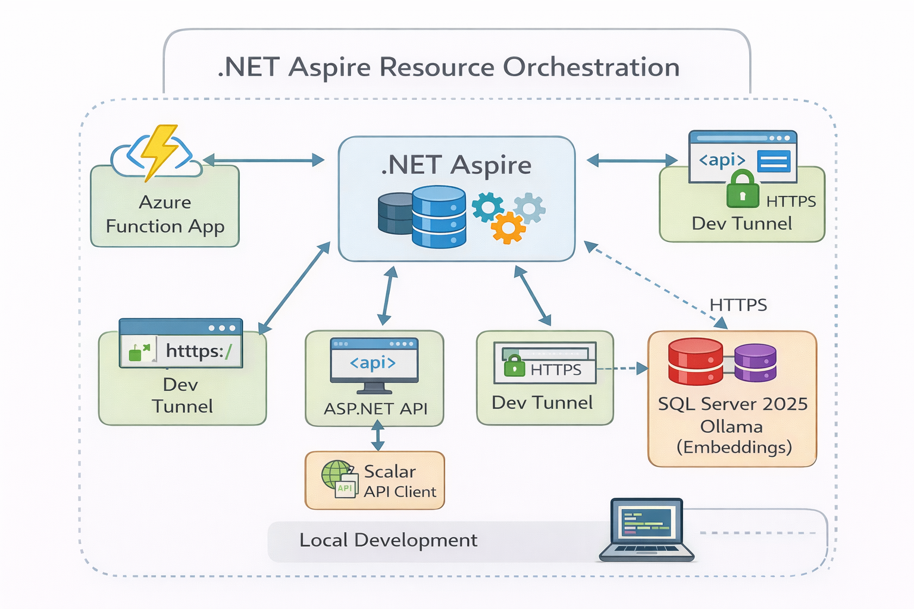
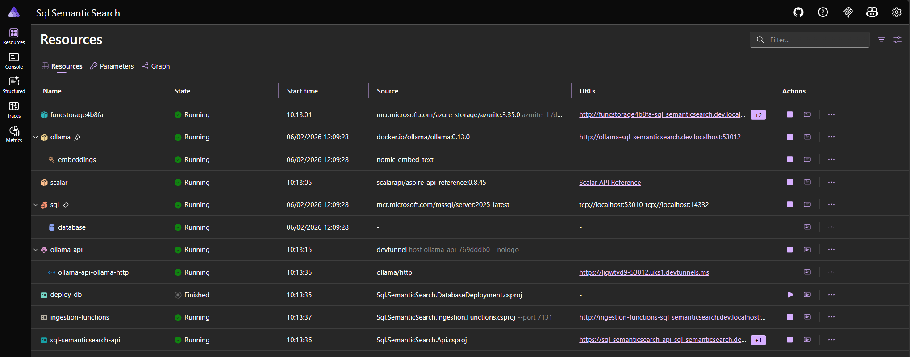
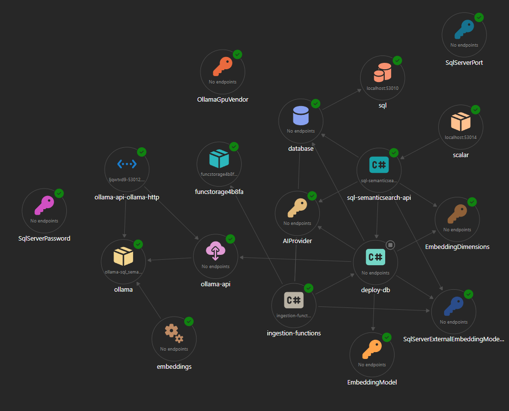

# How Aspire unlocks local development
## Using Aspire to develop the SQL Server 2025 Semantic Search application

In my previous post, I showed a proof of concept of a semantic search pipeline using SQL Server 2025 vector embeddings. It pulls in documents from arXiv, generates embeddings, stores them in SQL Server, and then performs vector similarity search.

To make it work end-to-end, I needed:

- A SQL Server database 2025 with preview AI features enabled
- Database initialization scripts 
- An embedding running locally in Ollama
- A dev tunnel providing a secure HTTPS endpoint so SQL Server can call Ollama
- An Azure function for document ingestion
- An ASP.NET Web API for search queries
- Scalar, an API Client for OpenAPI

There's a lot of plumbing involved, and a couple of years ago you’d have to manually create Docker containers, run database deployment scripts, configure connection strings, add HTTPS endpoints... the list goes on. 

With Aspire we can put it all together and get these services running together reliably. All we need is the right packages and a few lines of code.

Let's go through it.

## Getting started

The application is written for .NET 10 and I use Visual Studio 2026, but Visual Studio Code is also a solid choice. Everything here should work on non-Windows machines. You'll need a container solution like Docker or Podman - I use Docker Desktop.

I started with an empty Aspire application from a template. I set everything up the way I like it, with centrally managed NuGet packages, a shared project with constants that replace "magic strings", and a Directory.build.props with common project settings and static code analysis. These are all optional and I won't go into detail in this article - maybe another time.

I then built up the application by adding projects and added those to the Aspire orchestration. The core of the application is the AppHost.

## Aspire AppHost

We'll need a few NuGet packages for Azure functions, SQL Server, Ollama, and DevTunnels - we'll need this last one so that SQL Server can talk to Ollama over https. I've also added Scalar so we can see the API details using OpenAPI.
- Aspire.Hosting.Azure.Functions
- Aspire.Hosting.DevTunnels
- Aspire.Hosting.SqlServer
- CommunityToolkit.Aspire.Hosting.Ollama
- Scalar.Aspire

The main projects are referenced from the AppHost project. Note the `AspireProjectMetadataTypeName` in the references that let us use a shorter name when using the project in code. Also note `IsAspireProjectResource="false"` for the Shared project - this is where the "magic strings" constants are defined.
```
<ItemGroup>
  <ProjectReference Include="..\Sql.SemanticSearch.Api\Sql.SemanticSearch.Api.csproj" AspireProjectMetadataTypeName="Api" />
  <ProjectReference Include="..\Sql.SemanticSearch.DatabaseDeployment\Sql.SemanticSearch.DatabaseDeployment.csproj" AspireProjectMetadataTypeName="DatabaseDeployment" />
  <ProjectReference Include="..\Sql.SemanticSearch.Ingestion.Functions\Sql.SemanticSearch.Ingestion.Functions.csproj" AspireProjectMetadataTypeName="IngestionFunctions" />
  <ProjectReference Include="..\Sql.SemanticSearch.Shared\Sql.SemanticSearch.Shared.csproj" IsAspireProjectResource="false" />
</ItemGroup>
```
  
Parameters are defined in `appsettings.json` and can be overridden in user secrets:
```
"Parameters": {
  "AIProvider": "Ollama",
  "EmbeddingModel": "nomic-embed-text",
  "EmbeddingDimensions": 768,
  "SqlServerExternalEmbeddingModel": "SemanticSearchOllamaEmbeddingModel",
  "SqlServerPort": "",
  "SqlServerPassword": "",
  "OllamaGpuVendor": ""
},
```

The SQL Server port and password are useful if you want a connection string for SSMS - if you don't provide them then Aspire will generate different values every time.

  - Ollama with optional GPU support - this is controlled with a parameter which needs to be added to your secrets. It defaults to false.
  - The embedding model name and dimensionality is defined in the parameters - we are using `nomic-embed-text`. The number of dimensions needs to be set so we can set up the database correctly.
  - An external model will be created in SQL Server so the correct name needs to be provided in the parameters.
  - SQL Server. This has a persistent lifetime and a data volume so we don't need to set it up every time. Note the image has to be set because the default in Aspire is sql-2022 - this will no doubt be fixed in a future release. There are parameters for a default port and password; if provided this makes it easier to query the database from SQL Management Studio because the connection string won't change.

Here's the complete AppHost code, with parameters, SQL Server, Ollama, the dev tunnel, and the dependent services:
```
using Scalar.Aspire;
using Sql.SemanticSearch.AppHost.Extensions;
using Sql.SemanticSearch.AppHost.ParameterDefaults;
using Sql.SemanticSearch.Shared;

var builder = DistributedApplication.CreateBuilder(args);

var aiProviderParameter = builder.AddParameter(ParameterNames.AIProvider);
var embeddingModelParameter = builder.AddParameter(ParameterNames.EmbeddingModel);
var embeddingDimensionsParameter = builder.AddParameter(ParameterNames.EmbeddingDimensions);
var sqlServerExternalEmbeddingModelParameter = builder.AddParameter(ParameterNames.SqlServerExternalEmbeddingModel);
var gpuVendorParameter = builder.AddParameter(ParameterNames.GpuVendor, value: new BooleanParameterDefault(false));

var sqlServerPortParameter = builder.AddParameter(ParameterNames.SqlServerPort, value: new EmptyParameterDefault());
var sqlPasswordParameter = builder.AddParameter(ParameterNames.SqlServerPassword, value: new EmptyParameterDefault(), secret: true);

var ollama = builder.AddOllama(ResourceNames.Ollama)
    .WithGPUSupportIfAvailable(gpuVendorParameter)
    .WithLifetime(ContainerLifetime.Persistent)
    .WithDataVolume();

ollama.AddModel(ResourceNames.Embeddings, embeddingModelParameter.GetValue()!);

var devTunnel = builder.AddDevTunnel(ResourceNames.OllamaTunnel)
   .WithReference(ollama)
   .WithAnonymousAccess()
   .WaitFor(ollama);

var sqlServer = builder.AddSqlServer(ResourceNames.SqlServer)
    .WithImage("mssql/server", "2025-latest")
    .WithHostPortAndEndpointIfProvided(ResourceNames.SqlServerEndpoint, sqlServerPortParameter)
    .WithDataVolume()
    .WithPassword(sqlPasswordParameter)
    .WithLifetime(ContainerLifetime.Persistent)
    .AddDatabase(ResourceNames.SqlDatabase, DatabaseNames.DocumentsDatabase);

var databaseDeployment = builder.AddProject<Projects.DatabaseDeployment>(ResourceNames.DatabaseDeployment)
    .WithReference(sqlServer)
    .WithReference(ollama, devTunnel)
    .WithEnvironment(ParameterNames.AIProvider, aiProviderParameter)
    .WithEnvironment(ParameterNames.EmbeddingDimensions, embeddingDimensionsParameter)
    .WithEnvironment(ParameterNames.EmbeddingModel, embeddingModelParameter)
    .WithEnvironment(ParameterNames.SqlServerExternalEmbeddingModel, sqlServerExternalEmbeddingModelParameter)
    .WaitFor(devTunnel)
    .WaitFor(sqlServer);

builder.AddAzureFunctionsProject<Projects.IngestionFunctions>(ResourceNames.IngestionFunctions)
    .WithReference(sqlServer)
    .WithEnvironment(ParameterNames.AIProvider, aiProviderParameter)
    .WithEnvironment(ParameterNames.SqlServerExternalEmbeddingModel, sqlServerExternalEmbeddingModelParameter)
    .WaitForCompletion(databaseDeployment);

var api = builder.AddProject<Projects.Api>(ResourceNames.Api)
    .WithReference(sqlServer)
    .WithEnvironment(ParameterNames.AIProvider, aiProviderParameter)
    .WithEnvironment(ParameterNames.EmbeddingDimensions, embeddingDimensionsParameter)
    .WithEnvironment(ParameterNames.SqlServerExternalEmbeddingModel, sqlServerExternalEmbeddingModelParameter)
    .WaitForCompletion(databaseDeployment);

builder.AddScalarApiReference(options =>
{
    options
        .PreferHttpsEndpoint()
        .AllowSelfSignedCertificates();
})
    .WithApiReference(api);

await builder.Build().RunAsync().ConfigureAwait(true);
```

This single file defines the entire local system: SQL Server, Ollama, the tunnel, deployment, Functions, and the API.



## Key resources

### SQL Server

The AppHost adds a SQL Server resource and uses Docker image "2025-latest" - the current default in Aspire is SQL Server 2022 so I had to explicitly ask for the newer version. I expect future Aspire releases to update the default to SQL Server 2025 soon.

I define a data volume and persistent lifetime for SQL Server so it won't lose data between restarts. I'm also setting the password and port based on the parameters.

Lastly I add a database to the server. This will be available for the database initialisation that runs later.

### Ollama

Ollama is an open-source framework that hosts large language models (LLMs) locally. Aspire creates the Ollama instance and we add the embedding model to it.

A future version might change to use Azure OpenAI, but for now Ollama keeps things simple.

### Dev tunnels

SQL Server only allows HTTPS when calling external embedding models, but Ollama only exposes an HTTP endpoint. We need something that can sit between our application and Ollama. I've seen tutorials that involve setting up a reverse proxy with Nginx or Apache, but Aspire's dev tunnels give us the same result with much less effort.

The dev tunnel references Ollama and exposes an HTTPS endpoint that can be passed to the other applications. We're running everything on one machine; I've used the same approach to allow cloud services to call code on my local machine so I can debug it.

**Note** - Dev tunnels are great for testing and development, but they are not intended for production use.

### Function app

This is an isolated function app with an HTTP endpoint. I added it through Visual Studio and selected the checkbox to enrol in the Aspire orchestration - this didn't work for me so I had to add a reference to the ServiceDefaults project and call builder.AddServiceDefaults() in Program.cs, then remove the app insights because it will be managed via service defaults:
```csharp
builder.Services
    .AddApplicationInsightsTelemetryWorkerService()
    .ConfigureFunctionsApplicationInsights();
```

### API

This is a standard ASP.NET Web API project. It exposes the search API endpoints.

### Scalar

I added `Scalar.Aspire` to the AppHost. Scalar provides a front end for OpenAPI and replaces Swagger with a cleaner API reference experience. It is fully integrated into the Aspire dashboard. 

I've only added Scalar for the API project because I couldn't get it working for the functions app. 

## Database deployment with DbUp

The `Sql.SemanticSearch.DatabaseDeployment` project uses **DbUp** to deploy the database from scripts embedded into the assembly.

It sets up some variables for use in the scripts:
```
Dictionary<string, string> variables = new()
{
    { EnvironmentVariables.AIProvider, aiProvider.ToUpperInvariant() },
    { EnvironmentVariables.AIEndpoint, endpoint },
    //{ EnvironmentVariables.AIClientKey, Env.GetString("OPENAI_KEY")},
    { EnvironmentVariables.EmbeddingModel, embeddingModel! },
    { EnvironmentVariables.EmbeddingDimensions, embeddingDimensions.ToString("D", CultureInfo.InvariantCulture) },
    { EnvironmentVariables.ExternalEmbeddingModel, externalEmbeddingModel! }
};
```

It then deploys in three stages: 
1. scripts that have "server-configuration" in the name. These scripts fail if run inside a transaction so I've separated them.
2. The main deployment scripts that create tables, schemas, seed data etc.
3. scripts with "always-run" in the name. These will be run on every deployment as they aren't added to the deployment state in the database (`.JournalTo(new NullJournal())`). I needed this because the dev tunnel port can change between runs, so I decided to recreate the Ollama model if details had changed.

```
const string AlwaysRunTag = "always-run";
const string ServerConfigurationTag = "server-configuration";
```

```
var result = DeployChanges.To
    .SqlDatabase(connectionString)
    .WithVariables(variables)
    .WithScriptsEmbeddedInAssembly(
            typeof(Program).Assembly,
            /* Server configuration scripts that have to run outside of a transaction */
            f => f.Contains(ServerConfigurationTag, StringComparison.InvariantCultureIgnoreCase))
    .AddLoggerFromServiceProvider(serviceProvider)
    .Build()
    .PerformUpgrade();

if (result.Successful)
{
    result = DeployChanges.To
    .SqlDatabase(connectionString)
    .WithVariables(variables)
    .WithScriptsEmbeddedInAssembly(
            typeof(Program).Assembly,
            f => !f.Contains(AlwaysRunTag, StringComparison.InvariantCultureIgnoreCase))
    .WithTransaction()
    .AddLoggerFromServiceProvider(serviceProvider)
    .Build()
    .PerformUpgrade();
}

if (result.Successful)
{
    result = DeployChanges.To
        .SqlDatabase(connectionString)
        .WithVariables(variables)
        .WithScriptsEmbeddedInAssembly(
            typeof(Program).Assembly,
            f => f.Contains(AlwaysRunTag, StringComparison.InvariantCultureIgnoreCase))
        .JournalTo(new NullJournal())
        .WithTransaction()
        .AddLoggerFromServiceProvider(serviceProvider)
        .Build()
        .PerformUpgrade();
}
```

I've included a script that drops all the tables in the repo - sql/clean_documents_database.sql.

## Resilience and ServiceDefaults

The ServiceDefaults project has extensions that set up a standard resilience pipeline with Polly and adds observability with OpenTelemetry. All service projects call builder.AddServiceDefaults so everything works in the same way.

Telemetry is collected locally and you can see it in the Aspire dashboard or export it to Application Insights or another provider. I'm not going to go into detail, but the Aspire documentation has a good overview: [Telemetry](https://aspire.dev/fundamentals/telemetry/). 

I've extended ServiceDefaults, adding:

- **Database resilience** - Databases can experience transient failures and timeouts, especially in serverless cloud environments. To avoid flaky runs during development I've now added a resilience pipeline with retries. The pipeline is in ServiceDefaults and it's used in the services that call SQL Server.
- **Ollama resilience** - Ollama can take a long time to respond to complex requests. That's unlikely to happen with the embedding model, but I increased timeouts in anticipation of future expansion towards chat-based scenarios. The code is in the ServiceDefaults `AddServiceDefaults` method which has been extended with an optional flag telling it to use longer timeouts.

## Screenshots

The application runs with a dashboard that has the running resources with links:


It also includes an interactive graph of the application:


## Conclusion

In this project, Aspire handled orchestration for everything:

- SQL Server running in a container
- Ollama hosting an embedding model
- Dev tunnels providing HTTPS endpoints
- Database deployment
- Azure Function ingestion pipeline
- ASP.NET semantic search API
- A dashboard to run and observe it all

Without Aspire, putting this together would have involved a lot of manual setup. 

But where Aspire really adds value is when moving to a new machine or when new developers join the team. With Aspire, the setup experience is:

    Clone the repo → Run the AppHost → Everything starts.

That’s a massive timesaver, especially as more applications start to blend traditional backend services with AI components like embedding models, vector databases, and external inference endpoints.

I'm still in the early proof of concept stage of this project, but Aspire has already made it feel like a real system. It’s easy to see how the approach could scale from local development into a full Azure deployment. 
Aspire has CLI tools that make it easy to deploy to Azure or create CI/CD pipelines - something for a future article.

I'll definitely be using Aspire more as I explore what SQL Server 2025 and modern .NET applications can do together.

### Source code
[!NOTE] 
> Source code is available on [GitHub](https://github.com/mikewild-wcl/sql-semanticsearch)

## References

[Dev Tunnels integration](https://aspire.dev/integrations/devtools/dev-tunnels/)
[Ollama integration](https://aspire.dev/integrations/ai/ollama/)
[Get started with the SQL Server Entity Framework Core integrations](https://aspire.dev/integrations/databases/efcore/sql-server/sql-server-get-started/)
[Scalar API Reference for .NET Aspire](https://scalar.com/products/api-references/integrations/aspire)
Repo with database migration examples - [SQL Server Aspire Samples](https://github.com/Azure-Samples/azure-sql-db-aspire)
Aspire observability - [Telemetry](https://aspire.dev/fundamentals/telemetry/)

