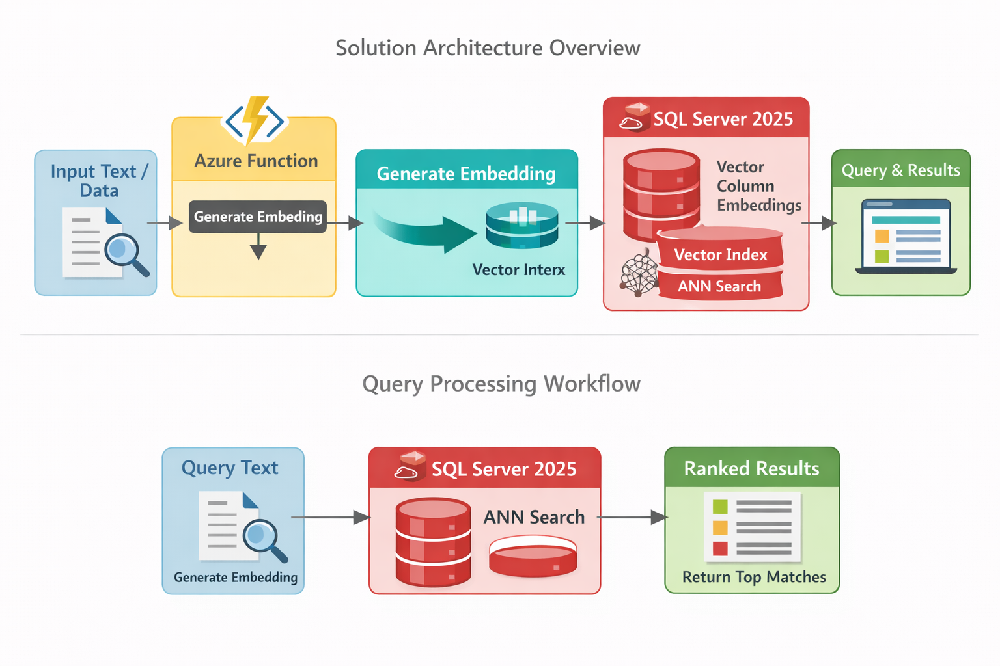

# Modern Vector Search With SQL Server 2025 + Azure Functions


## 1. Introduction

Vector search has quickly become a foundational capability for building
intelligent applications: semantic search, RAG pipelines, product
matching, data classification, and more. But until recently, running
vector search inside SQL Server required complex workarounds or external
search engines.

**SQL Server 2025 changes everything** by introducing:

-   Native `VECTOR` data type\
-   Built-in approximate nearest neighbor (ANN) vector indexes\
-   Fast similarity functions (cosine, dot-product, Euclidean)\
-   Hardware acceleration for vector math

When you pair this with **Azure Functions** generating embeddings via
Azure OpenAI, you get a simple, modern, cloud-native way to add semantic
intelligence to any application.

This article walks through how to architect and build this integration
end-to-end.

------------------------------------------------------------------------

## 2. Why SQL Server 2025 Is a Breakthrough

Previous versions of SQL Server had no vector-native capabilities.
Developers resorted to storing embeddings as text or blobs and doing
cosine similarity in application code.

SQL Server 2025 introduces:

### **Native Vector Type**

``` sql
VECTOR(1536)
```

### **Vector Search Functions**

-   `VECTOR_DISTANCE(vec1, vec2, COSINE)`
-   `VECTOR_DISTANCE(vec1, vec2, DOT_PRODUCT)`
-   `VECTOR_DISTANCE(vec1, vec2, EUCLIDEAN)`

### **High-Performance ANN Indexes**

``` sql
CREATE VECTOR INDEX IX_Doc_Embedding
ON Documents(Embedding)
WITH (DISTANCE_MEASURE = COSINE);
```

This means SQL Server now behaves like a first-class vector database ---
no external services required.

------------------------------------------------------------------------

## 3. Solution Overview

Your application workflow looks like this:

1.  Client app sends text to process\
2.  Azure Function generates an embedding (via Azure OpenAI)\
3.  Embedding is stored directly in a SQL Server 2025 vector column\
4.  Queries generate embeddings and ask SQL Server for the top-N
    matches\
5.  SQL Server performs ANN vector search internally and returns ranked
    results

This is a massive simplification compared to older architectures.



------------------------------------------------------------------------

## 4. Azure Functions as the Embedding Generator

Azure Functions acts as the "AI adapter layer" that converts text into
embeddings.

Benefits:

-   Serverless auto-scale\
-   Cheap and low-overhead\
-   Secure connection to SQL (Managed Identity)\
-   Works with any app: web, mobile, legacy desktop, or batch jobs

You only need a simple HTTP-triggered function.

------------------------------------------------------------------------

## 5. Creating the SQL Server 2025 Schema

Here is a minimal schema using native vector search:

``` sql
CREATE TABLE Documents (
    Id INT IDENTITY PRIMARY KEY,
    Title NVARCHAR(200),
    Content NVARCHAR(MAX),
    Embedding VECTOR(1536)
);
```

Create the ANN index:

``` sql
CREATE VECTOR INDEX IX_Documents_Embedding
ON Documents(Embedding)
WITH (DISTANCE_MEASURE = COSINE);
```

That's all you need --- SQL Server handles similarity search natively.

------------------------------------------------------------------------

## 6. Azure Function: Insert Pipeline

This C# Azure Function inserts content + embedding:

``` csharp
[Function("InsertDocument")]
public async Task<HttpResponseData> Run(
    [HttpTrigger(AuthorizationLevel.Function, "post")] HttpRequestData req)
{
    var input = await req.ReadFromJsonAsync<DocumentInput>();

    // 1. Generate embedding
    var embedding = await openAI.GetEmbeddingAsync(input.Content);

    // 2. Insert into SQL
    using var conn = new SqlConnection(Environment.GetEnvironmentVariable("SqlConnection"));
    await conn.OpenAsync();

    var cmd = new SqlCommand(@"
        INSERT INTO Documents (Title, Content, Embedding)
        VALUES (@Title, @Content, @Embedding)", conn);

    cmd.Parameters.AddWithValue("@Title", input.Title);
    cmd.Parameters.AddWithValue("@Content", input.Content);
    cmd.Parameters.AddWithValue("@Embedding", embedding);

    await cmd.ExecuteNonQueryAsync();

    var response = req.CreateResponse(HttpStatusCode.OK);
    return response;
}
```

------------------------------------------------------------------------

## 7. Azure Function: Query Pipeline

Generate an embedding for the user query, then let SQL Server do vector
search:

``` sql
SELECT TOP 10
    Id, Title, Content,
    VECTOR_DISTANCE(Embedding, @QueryEmbedding, COSINE) AS Score
FROM Documents
ORDER BY Score;
```

In C#:

``` csharp
var cmd = new SqlCommand(@"
    SELECT TOP 10 Id, Title, Content,
    VECTOR_DISTANCE(Embedding, @Query, COSINE) AS Score
    FROM Documents
    ORDER BY Score", conn);

cmd.Parameters.AddWithValue("@Query", queryEmbedding);
```

SQL Server handles ANN search internally --- your Azure Function only
orchestrates.

------------------------------------------------------------------------

## 8. Performance Considerations

-   Use vector indexes for large datasets\
-   Cache embeddings client-side or in Redis\
-   Pre-clean your input text\
-   Keep embedding dimensionality consistent

SQL Server 2025 provides hardware-accelerated similarity search, so
performance is excellent even for millions of rows.

------------------------------------------------------------------------

## 9. Real-World Use Cases

-   Intelligent search across enterprise knowledge bases\
-   Product similarity / recommendation systems\
-   Ticket classification\
-   RAG (Retrieval-Augmented Generation) over documents stored in SQL\
-   Duplicate detection / entity matching

If your business runs on SQL Server, this upgrade lets you add AI
capabilities without changing databases.

------------------------------------------------------------------------

## Conclusion

With SQL Server 2025 and Azure Functions, vector search becomes:

-   Simple\
-   Scalable\
-   Native to SQL\
-   Cloud-friendly

This architecture lets you integrate modern AI features into any
existing app --- even those relying on SQL Server for decades.


------------------------------------------------------------------------

This draft was generated by ChatGPT on 13/01/2025.
